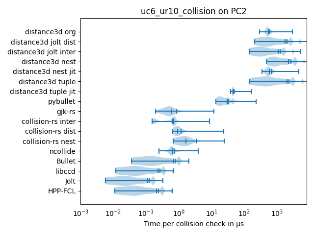

# Benchmarking Collision Detection for Robotics

## Abstract
Collision detection in robotics plays an important role in simulation, planning, and control. In particular, Gilbert-Johnson-Keerthi (GJK) and its variations are still widely used. We are interested in the question of how programming language, algorithm engineering, and implementation tricks influence its performance. We develop a benchmark that resembles how GJK is used in a highly optimized collision detection pipeline for robotics and compare the performance of commonly used implementations of GJK. We analyse not just the moments of the distribution of runtimes, but the whole distribution, which is relevant for real-time applications.
Surprisingly, we obtain one of the best performances with the Jolt game engine, which is usually not used in robotics and does not implement the latest algorithmic developments.
We also found that highly optimized C++ libraries are still considerably faster than more recently developed Rust libraries, and that Python cannot be used when performance is a constraint, even when highly optimized, compiled code is called.
Statistical tests show that differences between the most commonly used C++ libraries are significant, but mostly negligible.

## Results


### Runtime Distributions

<p float="left">
  
   
</p>

<p float="left">
  
  
</p>

### UC1 with UR10 Collision Environment on PC1

Results of hypothesis testing for time per collision test in **UC1 with UR10 collision environment on PC1**. The alternative hypothesis is $T_{\text{row}} < T_{\text{column}}$. *ns* indicates not significant results, i.e., $T_{\text{row}} \geq T_{\text{column}}$ was not rejected. When the result is significant, we report the common language effect size (the number of time measurements of the algorithm given in the row that are less than measurements of the algorithm in the column, 0 indicates the largest effect).

#### C++ Group

| | *HPP-FCL* | Jolt | libccd | Bullet |
|-|-|-|-|-|
| *HPP-FCL* |  | 0.44 | 0.36 | 0.11 |
| Jolt | ns |  | 0.44 | 0.18 |
| libccd | ns | ns |  | 0.19 |
| Bullet | ns | ns | ns |  |

#### Rust Group

| |ncollide |c-rs nest |c-rs dist | *c-rs inter* |gjk-rs |
|-|-|-|-|-|-|
| ncollide | |0.03 |0.16 |ns |ns |
| c-rs nest |ns | |ns |ns |ns |
| c-rs dist |ns |0.20 | |ns |ns |
| *c-rs inter* |0.36 |0.00 |0.02 | |0.41 |
| gjk-rs |0.46 |0.08 |0.22 |ns | |

#### Python Group

| | *pybullet* | d3d tuple acc | d3d tuple no acc | d3d nest acc | d3d nest no acc | d3d jolt dist | d3d jolt inter | d3d org |
|-|-|-|-|-|-|-|-|-|
| *pybullet* |  | 0.02 | 0.00 | 0.00 | 0.00 | 0.00 | 0.00 | 0.00 |
| d3d tuple acc | ns |  | 0.00 | 0.00 | 0.00 | 0.00 | 0.00 | 0.00 |
| d3d tuple no acc | ns | ns |  | 0.46 | 0.27 | 0.41 | ns | 0.43 |
| d3d nest acc | ns | ns | ns |  | 0.12 | 0.46 | ns | 0.34 |
| d3d nest no acc | ns | ns | ns | ns |  | ns | ns | ns |
| d3d jolt dist | ns | ns | ns | ns | 0.31 |  | ns | 0.49 |
| d3d jolt inter | ns | ns | 0.35 | 0.31 | 0.14 | 0.27 |  | 0.26 |
| d3d org | ns | ns | ns | ns | 0.19 | ns | ns |  |

### UC6 with UR10 Collision Environment on PC1

Results of hypothesis testing for time per collision test in **UC6 with UR10 collision environment on PC1**. The alternative hypothesis is $T_{\text{row}} < T_{\text{column}}$. *ns* indicates not significant results, i.e., $T_{\text{row}} \geq T_{\text{column}}$ was not rejected. When the result is significant, we report the common language effect size (the number of time measurements of the algorithm given in the row that are less than measurements of the algorithm in the column, 0 indicates the largest effect).

#### C++ Group

| | HPP-FCL | *Jolt* | libccd | Bullet |
|-|-|-|-|-|
| HPP-FCL |  | ns | 0.41 | 0.21 |
| *Jolt* | 0.43 |  | 0.34 | 0.16 |
| libccd | ns | ns |  | 0.27 |
| Bullet | ns | ns | ns |  |

#### Rust Group

| | ncollide | c-rs nest | c-rs dist | c-rs inter | *gjk-rs* |
|-|-|-|-|-|-|
| ncollide |  | 0.03 | 0.12 | 0.45 | ns |
| c-rs nest | ns |  | ns | ns | ns |
| c-rs dist | ns | 0.15 |  | ns | ns |
| c-rs inter | ns | 0.01 | 0.09 |  | ns |
| *gjk-rs* | 0.40 | 0.08 | 0.18 | 0.44 |  |

#### Python Group

| | *pybullet* | d3d tuple acc | d3d tuple no acc | d3d nest acc | d3d nest no acc | d3d jolt dist | d3d jolt inter | d3d org |
|-|-|-|-|-|-|-|-|-|
| *pybullet* |  | 0.14 | 0.00 | 0.00 | 0.00 | 0.00 | 0.00 | 0.00 |
| d3d tuple acc | ns |  | 0.00 | 0.00 | 0.00 | 0.00 | 0.00 | 0.00 |
| d3d tuple no acc | ns | ns |  | ns | 0.42 | 0.48 | ns | ns |
| d3d nest acc | ns | ns | 0.20 |  | 0.05 | 0.17 | 0.28 | 0.40 |
| d3d nest no acc | ns | ns | ns | ns |  | ns | ns | ns |
| d3d jolt dist | ns | ns | ns | ns | 0.42 |  | ns | ns |
| d3d jolt inter | ns | ns | 0.37 | ns | 0.28 | 0.36 |  | ns |
| d3d org | ns | ns | 0.20 | ns | 0.04 | 0.18 | 0.29 |  |

## Folder-Structure
- [compare-cpp/README](./compare-cpp/README.md)
- [compare-rust/README](./compare-rust/README.md)
- [compare-python/README](./compare-python/README.md)
- [data/README](./data/README.md)
- [scripts/README](./scripts/README.md)

## Setup

### Unzip test Data
Unzip the data in ./data Follow the insurctions in the [README](./data/README.md)

### Build and Run Docker
```bash
docker buildx build -t compare .
docker run --mount type=bind,source="./results",target="/collision-comparison/results" --rm -it --entrypoint bash compare
```

### Run bechmark in docker
```bash
cd /collision-comparison
sh scripts/benchmarks/benchmark_uc1_ur10.sh 
# or
sh scripts/benchmarks/benchmark_uc6_ur10.sh 
```

## Results 
### How many Folders are done?
```bash
cd results
tree -L 1 | tail -1
```

### Analyzing Results
Put Data from results folder in results-archive
Create a folder for every pc. 
Put the results in a sub folder with the name of the test case. 
For example like this: `./results-archive/UPLINX-4-U/uc6_ur10_collision`

To analyze the results archive run
```bash
sh ./scripts/analyze/analyze_results.sh
```

### Result Dataset 
A zip Archive of all the recorded data is saved in the dfki Fileserver at the path: `Research/projects/ongoing/APRIL_FK_21170/documentation/experiments`


## Setup on Manjaro (without Docker)
```bash
sudo pacman -Suy --noconfirm --needed \
    go \
    eigen \
    boost \
    assimp \
    clang \
    ninja \
    curl \
    glu

yay -Syy --noconfirm octomap

## Install Python 3.8
yay -Syy --noconfirm python38

## Install Rust
curl --proto '=https' --tlsv1.2 -sSf https://sh.rustup.rs | sh -s -- -y

# Jolt
git clone https://github.com/MaartenBehn/JoltPhysics.git \
 && cd JoltPhysics/Build \
 && sh ./cmake_linux_clang_gcc.sh Distribution \
 && cd Linux_Distribution \
 && make -j 8 && ./UnitTests \
 && cd ../../..

# Libccd
git clone https://github.com/danfis/libccd.git \
 && cd libccd \
 && mkdir build && cd build \
 && cmake -G "Unix Makefiles" .. \
 && make \
 && cd ../..

# Bullet
git clone https://github.com/MaartenBehn/bullet3.git

# Fcl
git clone https://github.com/MaartenBehn/hpp-fcl.git \  
 && cd hpp-fcl \
 && git submodule update --init \
 && cd ..

# Compare-cpp dependecies
git clone https://github.com/nlohmann/json.git \
 && git clone https://github.com/martinus/nanobench.git \
 && git clone https://github.com/g-truc/glm.git 

# Setup venv
python3.8 -m venv venv/ \
 && ./venv/bin/python3 -m pip install --upgrade pip 

# distance3d
git clone https://github.com/MaartenBehn/distance3d.git 

# Install distance3d
./venv/bin/pip install -e ./distance3d 

# Install Pybullet
./venv/bin/pip install pybullet

# collision-rs
git clone https://github.com/MaartenBehn/collision-rs.git

# gjk-rs
git clone https://github.com/MaartenBehn/gjk-rs.git

rm -rf collision-comparison/compare-cpp/build_release

cd compare-cpp \
 && mkdir build_release/ \
 && cd ..

sh scripts/compile/compile_compare_release.sh

# --- Compare-Python ---

# Run python benchmark once
export PYTHONPATH="${PYTHONPATH}:collision-comparison/compare-python" \
 && sh scripts/benchmarks/benchmark_python.sh

# --- Compare-rs ---
rm -rf collision-comparison/compare-rs/target

# Run rust benchmark once
source "$HOME/.cargo/env" \
 && sh scripts/benchmarks/benchmark_rust.sh
```

## Building URDFs (not needed; Final URDF are in Repo)
```bash
cd data/urdf

# Getting the Nao URDF:
# This part is a bit hacky. We essently just want the urdf of the nao robot and its mesh files. 
# This is nomally setup with ros so I modifieyed the cmake files to not have it crash.
cd nao
git clone git@github.com:ros-naoqi/nao_robot.git
git clone git@github.com:MaartenBehn/nao_meshes.git
cd nao_meshes
mkdir build
cd build
cmake ..
make ._meshes # Follow the installer just press enter and say yes
cd ../../..

# Getting the Atlas URDF:
cd atlas
git clone git@github.com:team-vigir/vigir_atlas_common.git
cd ..

# Getting the UR 10 and UR 5 URDF:
cd ur
git clone git@github.com:aprilprojecteu/april_robot_description.git
git clone git@github.com:ros-industrial/universal_robot.git
cd ../..
```

